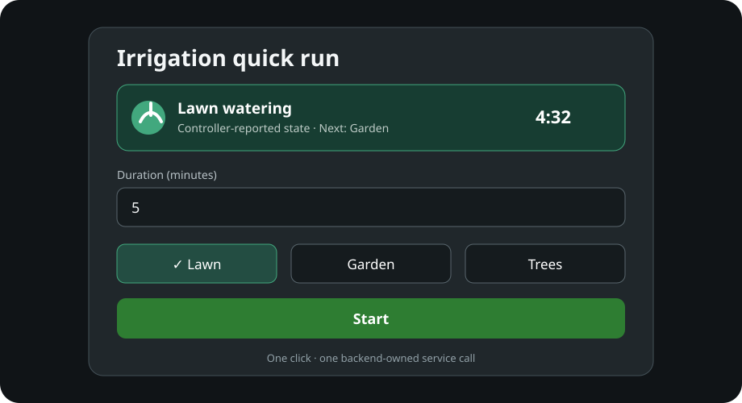

<p align="center">
  
</p>

# Sprinkler Sequence Card

[](https://github.com/shogun301/sprinkler-sequence-card/actions/workflows/validate.yml)

A provider-neutral Home Assistant dashboard card for bounded single-zone and multi-zone sprinkler runs. One click sends exactly one service call. The integration or automation behind that service owns sequencing, timers, transitions, and stopping.



The project logo is original artwork. Its editable SVG source and 256/512-pixel
PNG exports are included under `assets/`.

## Safety model

- The card requires a controller status entity and enables Start only for explicitly configured idle states.
- Missing, unavailable, unknown, pending, or unmapped states fail closed.
- Sequence mode never loops over zones in the browser; it calls one backend sequence service.
- Single-zone mode requires exactly one selected zone and calls one zone service.
- Pause, resume, and stop are optional and only enabled for compatible known runtime states.
- Targets are limited to exactly one literal controller `device_id` or `entity_id`.
- Per-zone and total duration limits are validated before submission.

Controller-reported state is not proof of water flow or valve position unless your backend exposes physical telemetry.

## Installation

### HACS

1. Add this repository as a custom HACS **Dashboard** repository.
2. Install **Sprinkler Sequence Card**.
3. Reload the browser after HACS adds the frontend resource.

### Manual

Copy `dist/sprinkler-sequence-card.js` to `/config/www/`, then add `/local/sprinkler-sequence-card.js` as a JavaScript module under **Settings → Dashboards → Resources**.

## WyzeAPI preset

The `wyzeapi` preset maps the bounded services provided by compatible `ha-wyzeapi` builds:

- `wyzeapi.run_sprinkler_sequence`
- `wyzeapi.run_sprinkler_zone`
- `wyzeapi.pause_sprinkler`
- `wyzeapi.resume_sprinkler`
- `wyzeapi.stop_sprinkler`

It does not contain a device ID, entity ID, zone name, network address, account identifier, or other household default. Supply the IDs created by your Home Assistant installation.

```yaml
type: custom:sprinkler-sequence-card
title: Irrigation quick run
preset: wyzeapi
mode: sequence
target:
  device_id: YOUR_CONTROLLER_DEVICE_ID
runtime:
  status_entity: sensor.your_controller_watering_status
  active_zone_entity: sensor.your_controller_active_zone
  remaining_entity: sensor.your_controller_watering_time_remaining
zones:
  - id: lawn
    name: Lawn
    value: 1
  - id: garden
    name: Garden
    value: 2
default_duration: 5
duration_unit: minutes
```

The preset reads `attributes.logical_run_state` first and falls back to the entity state. It understands the normalized logical-run attributes used by the compatible backend, while separate active-zone and remaining-time entities can be supplied as fallbacks.

## Generic adapter

Omit `preset` and explicitly map your backend. Service values always use `domain.service` form.

```yaml
type: custom:sprinkler-sequence-card
title: Greenhouse irrigation
mode: single_zone
target:
  entity_id: switch.irrigation_controller
services:
  start_zone: irrigation.run_zone
  pause: irrigation.pause
  resume: irrigation.resume
  stop: irrigation.stop
fields:
  zone: zone_id
  duration: seconds
  command_id: request_id
  source: source
runtime:
  status_entity: sensor.irrigation_controller_status
  state_path: state
  idle_states: [idle]
  running_states: [running]
  paused_states: [paused]
  pending_states: [starting, stopping]
  active_zone_entity: sensor.irrigation_active_zone
  remaining_entity: sensor.irrigation_remaining_seconds
  remaining_unit: seconds
zones:
  - id: bed-a
    name: Bed A
    value: bed_a
  - id: bed-b
    name: Bed B
    value: bed_b
limits:
  min_duration_seconds: 1
  max_duration_seconds: 1800
  max_total_seconds: 1800
  max_zones: 4
```

For sequence mode, configure `services.start_sequence` plus `fields.zones`, `fields.zone`, and `fields.duration`. The resulting data shape is:

```yaml
zones:
  - zone: 1
    duration_seconds: 300
  - zone: 2
    duration_seconds: 300
```

The card deliberately does not implement client-side delays or call the single-zone service repeatedly. If your backend lacks one atomic sequence service, use `single_zone` mode or add backend-owned sequencing first.

## Runtime mapping

Paths are constrained to `state` or `attributes.*`. Available mappings are:

| Option | Purpose |
| --- | --- |
| `status_entity` | Required controller/logical-run entity |
| `state_path` | Primary state path |
| `fallback_state_path` | Optional state fallback |
| `active_zone_path` | Zone service value inside the status entity |
| `active_zone_name_path` | Display name inside the status entity |
| `remaining_path` | Remaining time inside the status entity |
| `total_path` | Current-zone total time for progress |
| `queue_path` | Array of queued zones |
| `command_pending_path` | Boolean command-pending attribute |
| `active_zone_entity` | Separate active-zone entity fallback |
| `remaining_entity` | Separate remaining-time entity fallback |
| `remaining_unit` | `seconds` or `minutes` |

All four state groups—`idle_states`, `running_states`, `paused_states`, and `pending_states`—must be nonempty and nonoverlapping. Any other observed state disables actions.

## Visual editor

The dashboard editor covers the common preset, mode, target, status entity, duration, zone list, and control visibility settings. Advanced service, field, runtime-path, and limit mappings remain available in YAML.

## Development

```sh
npm run validate
```

Validation builds the distributable, checks JavaScript syntax, runs synthetic lifecycle/service-call tests, and scans public files for private paths, domains, addresses, identifiers, or credential-like assignments.

## License

Apache License 2.0. See [LICENSE](LICENSE).
